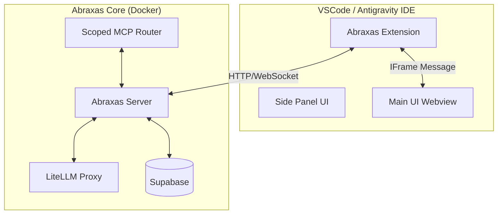

# Abraxas Architecture

## 1. Introduction

**Abraxas** is a high-performance, agentic development platform forked from Archon. While Archon serves as a general-purpose knowledge and task manager, Abraxas is designed to be an **integrated development environment extension** that lives directly within the developer's workflow (VSCode/Antigravity).

### Core Philosophy
- **Developer-First**: Lives where the code lives (VSCode Extension).
- **Agent-Centric**: Agents are first-class citizens with specialized toolsets (Scoped MCPs).
- **Model-Agnostic**: Universal LLM support via LiteLLM.
- **Performance**: Optimized context windows and isolated environments.

## 2. System Overview

Abraxas transitions from a standalone web application to a hybrid **VSCode Extension + Microservices** architecture.

## 3. Key Architectural Changes

### 3.1 Rebranding & Isolation (Goals 1 & 2)
- **Namespace**: All artifacts, docker containers, and environment variables will be prefixed with `abraxas-` to ensure zero conflict with existing Archon installations.
- **Ports**: A new port range will be assigned (e.g., 9000-9100) to allow simultaneous execution with Archon.

### 3.2 LiteLLM Integration (Goal 3)
- **Gateway Pattern**: The `abraxas-server` will no longer communicate directly with OpenAI/Anthropic.
- **Proxy Container**: A dedicated `litellm` container will handle all LLM traffic.
- **Benefits**:
    - Unified API format (OpenAI-compatible) for all models.
    - Centralized rate limiting and cost tracking.
    - Failover redundancy.

### 3.3 VSCode / Antigravity Integration (Goals 4 & 5)
- **Extension Host**: A new TypeScript-based VSCode Extension will serve as the client.
- **Webview UI**: The existing React frontend (`archon-ui-main`) will be adapted to run within a VSCode Webview.
    - *Challenge*: Handling routing and deep links within a webview.
    - *Solution*: Use `MemoryRouter` or a custom bridge for navigation.
- **Side Panel**: A lightweight view for quick agent access and prompt management, implemented as a VSCode WebviewView.

### 3.4 Dynamic Agent & Scoped MCPs (Goals 6 & 7)
- **The Problem**: Global MCP servers pollute the context window with irrelevant tools.
- **The Solution**: **Context-Aware MCP Routing**.
    - The `abraxas-mcp` server will expose dynamic endpoints: `/mcp/{agent_id}`.
    - Each endpoint filters the available tools based on the Agent's manifest.
    - **Example**:
        - `BackendAgent` sees: `database_tool`, `api_tool`.
        - `FrontendAgent` sees: `figma_tool`, `component_tool`.
        - `GeneralAgent` sees: `search_tool`.

### 3.5 Scrum & Task Management (Goal 8)
- **Data Model Enhancements**:
    - `sprints` table: Start/End dates, Goals.
    - `story_points` column in tasks.
    - `burndown_snapshots` table: Daily tracking of remaining points.
- **Visualization**: New "Sprint Board" and "Analytics" views in the Main UI.

## 4. Component Architecture

### 4.1 Abraxas Server (`python/src/server`)
- **Role**: Orchestrator.
- **Changes**:
    - Update `config.py` to support LiteLLM base URLs.
    - Add `AgentManager` service to handle dynamic agent definitions.

### 4.2 Abraxas MCP (`python/src/mcp_server`)
- **Role**: Tool Provider.
- **Changes**:
    - Refactor `FastMCP` implementation to support multiple instances or dynamic tool filtering.
    - Implement "Tool Scopes" metadata.

### 4.3 Abraxas Frontend (`archon-ui-main`)
- **Role**: User Interface.
- **Changes**:
    - **Agent Creator UI**: Drag-and-drop interface for defining agents and assigning MCP scopes.
    - **Scrum Dashboard**: Burndown charts and sprint planning views.
    - **VSCode Bridge**: Abstraction layer for communicating with the VSCode extension host.

## 5. Implementation Roadmap

1.  **Foundation**: Rename & Dockerize (Parallel with Archon).
2.  **Backend Core**: Integrate LiteLLM & Refactor MCP Server.
3.  **Extension**: Build the VSCode Extension shell.
4.  **UI Migration**: Port React app to Webview.
5.  **Advanced Features**: Scrum & Agent Creator.

## 6. Feasibility Assessment

| Goal | Feasibility | Complexity | Strategy |
|------|-------------|------------|----------|
| Rebranding | High | Low | Global Search/Replace |
| Docker Isolation | High | Low | Rename services & ports |
| LiteLLM | High | Low | Add container, update config |
| VSCode UI | High | Medium | Webview bridge implementation |
| Side Panel | High | Medium | New VSCode View provider |
| Agent Creator | High | Medium | New DB tables & UI forms |
| Scoped MCPs | High | High | Dynamic MCP routing logic |
| Scrum | High | Medium | Standard CRUD + Charting |

**Conclusion**: The proposed "Abraxas" architecture is technically sound and achievable. The shift to a VSCode Extension model provides the requested "first-class citizen" experience, while the backend improvements (LiteLLM, Scoped MCPs) address the scalability and context limits.
